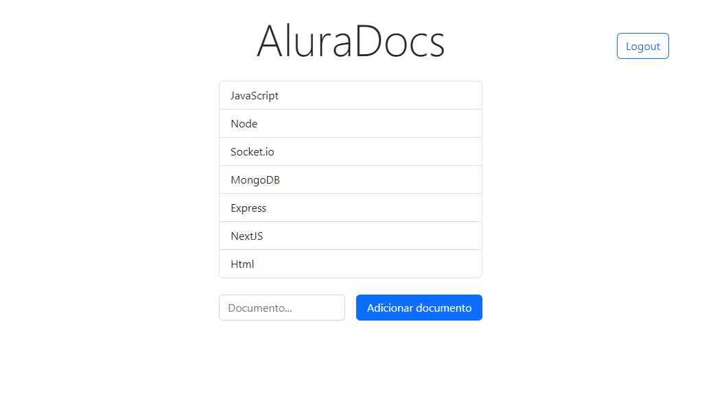

<div align="center">
  <h1><strong>Alura Docs - Sistema de Autenticação e Comunicação em Tempo Real</strong></h1>
</div>


Bem-vindo ao Alura Docs, um sistema desenvolvido para gerenciar autenticação de usuários, comunicação em tempo real e acesso a documentos de forma segura e eficiente. Este projeto foi construído utilizando Node.js, Socket.IO e JWT (JSON Web Token), com o objetivo de fornecer uma base sólida para sistemas que exigem autenticação robusta e comunicação síncrona entre clientes e servidores.

## Sobre o Projeto

O **Alura Docs** é um exemplo prático de aplicação que combina autenticação de usuários e comunicação em tempo real, ideal para cenários que exigem segurança no acesso e troca de informações entre clientes e servidores. O projeto foi desenvolvido como parte de um curso da Alura, onde foram exploradas diversas técnicas e boas práticas para construir uma aplicação segura e eficiente.

---

## Funcionalidades

### Gerenciamento de Usuários

- **Cadastro Seguro**: O sistema permite o cadastro de novos usuários com senhas criptografadas. Utilizamos o módulo `crypto` do Node.js para garantir que as senhas sejam armazenadas de forma segura no banco de dados.

- **Proteção de Senhas**: As senhas são protegidas utilizando "salting" e `hashing` para prevenir ataques de força bruta e ataques de dicionário.

### Autenticação e Autorização

- **Autenticação via JWT**: Usuários autenticados recebem um **JWT**, que é utilizado para validar o acesso a áreas restritas do sistema. O token é gerado no servidor e enviado ao cliente para ser armazenado nos cookies.

- **Middleware de Segurança**: Middlewares são aplicados para verificar a autenticidade dos usuários antes de conceder acesso a funcionalidades e áreas restritas da aplicação.

- **Namespaces no Socket.IO**: A aplicação utiliza namespaces para agrupar conexões, permitindo controle granular sobre eventos e middlewares em diferentes partes do sistema.

### Comunicação em Tempo Real

- **Gerenciamento de Conexões**: O servidor mantém uma lista ativa de usuários conectados a cada documento, permitindo que novos usuários vejam em tempo real quem está conectado.

- **Atualização Dinâmica**: Ao sair de um documento, o usuário é removido da lista ativa, e a interface do cliente é atualizada automaticamente para refletir a mudança.

- **Persistência de Dados no Socket**: Informações específicas sobre cada conexão são armazenadas no `socket.data`, facilitando a manipulação e o gerenciamento dessas informações durante a sessão.

## Estrutura do Projeto

```plaintext

├── public
│   ├── cadastro
│   │   ├── cadastro.js
│   │   ├── index.html
│   │   └── socket-front-cadastro.js
│   ├── documento
│   │   ├── documento.js
│   │   ├── index.html
│   │   └── socket-front-documento.js
│   ├── login
│   │   ├── index.html
│   │   ├── login.js
│   │   └── socket-front-login.js
│   └── utils
│       ├── cookies.js
│       ├── index.html
│       └── socket-front-index.js
├── servidor
│   ├── db
│   ├── middlewares
│   ├── registraEventos
│   │   ├── Cadastro.js
│   │   ├── Documento.js
│   │   ├── Inicio.js
│   │   └── login.js
│   └── utils
│       ├── autenticarUsuario.js
│       ├── conexoesDocumentos.js
│       ├── criaHashESalSenha.js
│       ├── gerarJwt.js
│       ├── servidor.js
│       └── socket-back.js
├── .env
├── .gitignore
├── package-lock.json
├── package.json
└── README.md

```

## Como Executar?

### Pré-requisitos


- Node.js (v14+)
- npm (v6+)
- Banco de dados configurado e acessível

### Passos para execução

1. **Instale as dependências:**

```bash

npm install

```

2. **Configuração do Ambiente:**

Crie um arquivo `.env` na raiz do projeto e adicione as variáveis de ambiente necessárias, como informações de conexão ao banco de dados e chaves secretas para JWT.

3. **Inicie o Servidor**

```bash

npm start

```

4. **Acesse a Aplicação:**

Abra o navegador e vá para `http://localhost:3000`.

## Tecnologias Utilizadas

- **Node.js**: Plataforma JavaScript server-side para construção do back-end.

- **Socket.IO**: Biblioteca para comunicação em tempo real entre cliente e servidor.

- **JWT (JSON Web Token)**: Mecanismo para autenticação e autorização segura.

- **Crypto (Node.js)**: Utilizado para criptografia de senhas e segurança de dados sensíveis.

- **Express.js**: Framework web minimalista para Node.js.

<div align="center">



</div>